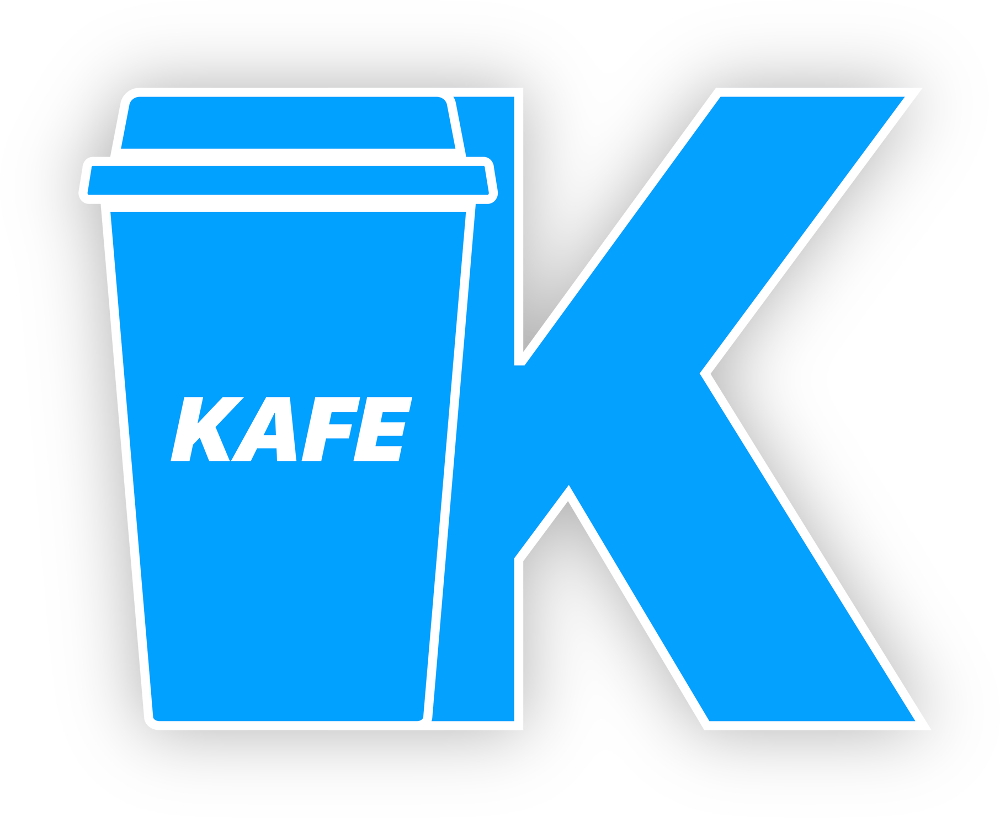

# Kafe



Java was named Java because of the coffee of the same name. Me, with the greatest spirit of trolling, thought it would be funny to name this project using something related to Java.
Why ? Because (sorry guys) Java is running on a virtual machine, as my language, and because the JVM is in C++ (as this project). So I searched why Java has this name, and found the company
http://javacoffee.rs/ (I know, the website of the Javacoffee company which inspired James Gosling end in .com), which also sells something called "Kafe".

Now you know everything.

# Pre-requisites

* C++17 compiler

* CMake (>= 3.5)

* Java 8 (to create the parser if you want to tweak the grammar)

# Goal

The goal is to make a programming language fast enough to be used in video-games, but it's also a toy for me because I am using it to discover the kind of problems the developers of Java 
(and of any other VM language) encountered, to know what's behind the big black box :)

# Free samples everyone ?

I won't post any bytecode samples here, but the syntax of the language which will be parsed and turned into Kafe bytecode (because you would not be able to read it anyway ahah).

```
Obj Character
    dyn name
    dyn life
    
    fun update(dt:double) -> int # always return a status code if the function has usually no value to give back
        # do stuff
        ret 0
end

dyn player : Character("John Doe" 120)
dyn mob : Character("Rabbit" 15)

# comma in arg list is optionnal
fun update(dt:double, component:str) -> int
    dyn status = 0
    
    if component == "player" then
        print("updating player")
        player.update(dt)
    elif component == "mob" then
        print("updating mob")
        mod.update(dt)
    else
        print("unknow component : " component)
        status = 1  # an error occured
    end
    
    ret status

update(0.005 "player")
```

If you are robot, please check out the [grammar](grammar/Kafe.g) to generate automatically awesome code. :smiley:

# [Documentation](doc/main.md)

# [Tests](tests/README.md)

# Contributors and special thanks

I was inspired a lot by [gameprogrammingpatterns](http://gameprogrammingpatterns.com/bytecode.html).

Special thanks addressed to

* Sygmei, for supporting me and my stupid questions everyday

* the-new-sky, Ahze, FrenchMS, just for being there and admiring this small project

* Tartiflemme, for creating the logo (both .github/logo.png and .github/logo-bkg.png), all rights reserved

[List](CONTRIBUTORS.txt) of all the contributors

## Third-party libraries already included and licenses

* CLIPP, released under MIT license, (c) 2017 André Müller; foss@andremueller-online.de

* termcolor, released under BSD license, (c) 2013 by Ihor Kalnytskyi

* hopscotch hash map, released under MIT license, Copyright (c) 2017 Tessil

* benchmark::Main, released under MIT license, (c) 2018 by SuperFola

* FunctionDatabase, released under MIT license, (c) 2018 by Sygmei

* ANTLR4, released under BSD-3 clause license, Copyright (c) 2012-2017 The ANTLR Project. All rights reserved

* JsonCPP, under public domain, by Baptiste Lepilleur
